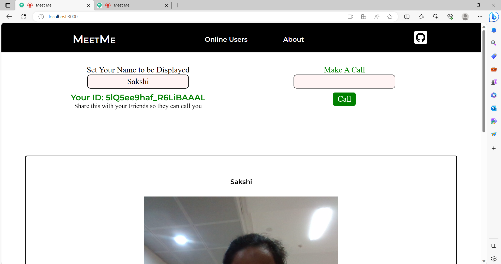
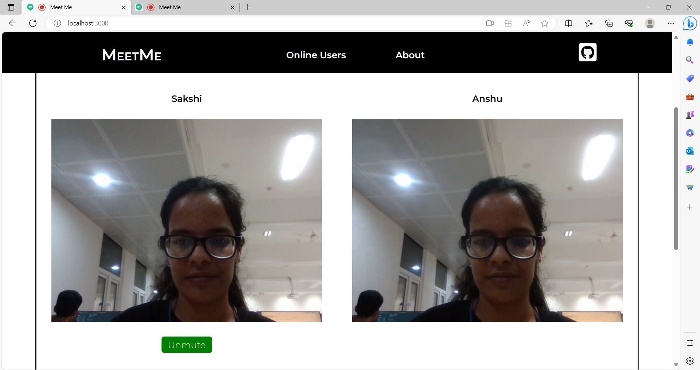

# Meet-Me

A video calling application built in your web browser
Implemented using WebRTC, I used Simple-Peer JS which is a wrap around WebRTC and simplifies things. 
Socket IO is used for synchronization and handshakes between the users.\
Front end is done using ReactJS. Works on both computers and mobiles (full responsive design)

## Features

- Call your friends by getting their unique id.
- Call random online users.
- Cross platform, supported on mobile devices.

## Screenshots

### Home page 


### Call Request is sent to other user.


### Running locally on a device with 2 tabs open, one calling the other.


### Mute/Unmute button is there to mute/unmute yourself.


### Send Call request to online users.


### Mobile responsive view of website


### Two videos are showing up in vertical way, with button to mute


### Hamberger Menu with the navbar options.


## Run Locally

Clone the project

```bash
  git clone https://github.com/Sakshijain12/meet-me.git
```

Go to the project directory

```bash
  cd meet-me
```

Install dependencies

```bash
  npm install
```

Start the server

```bash
  npm run start
```

Go to the client directory

```bash
  cd client
```

Start the front-end

```bash
  npm run start
```

Open http://localhost:3000 to access the website
